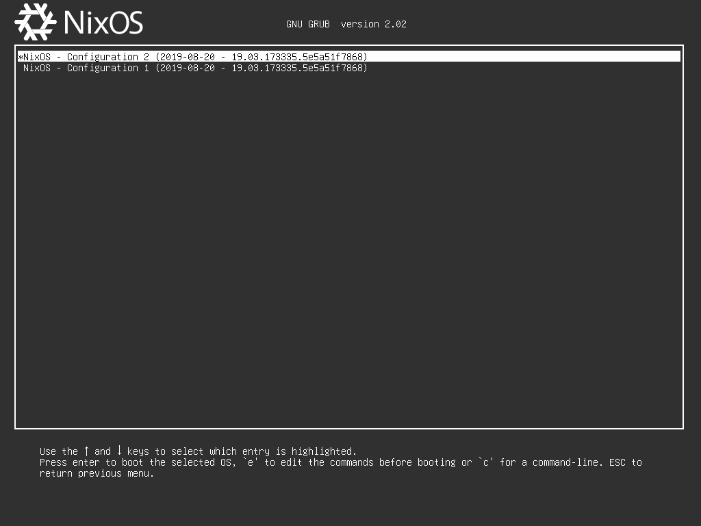
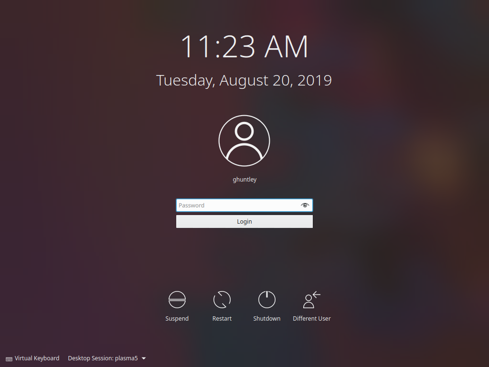
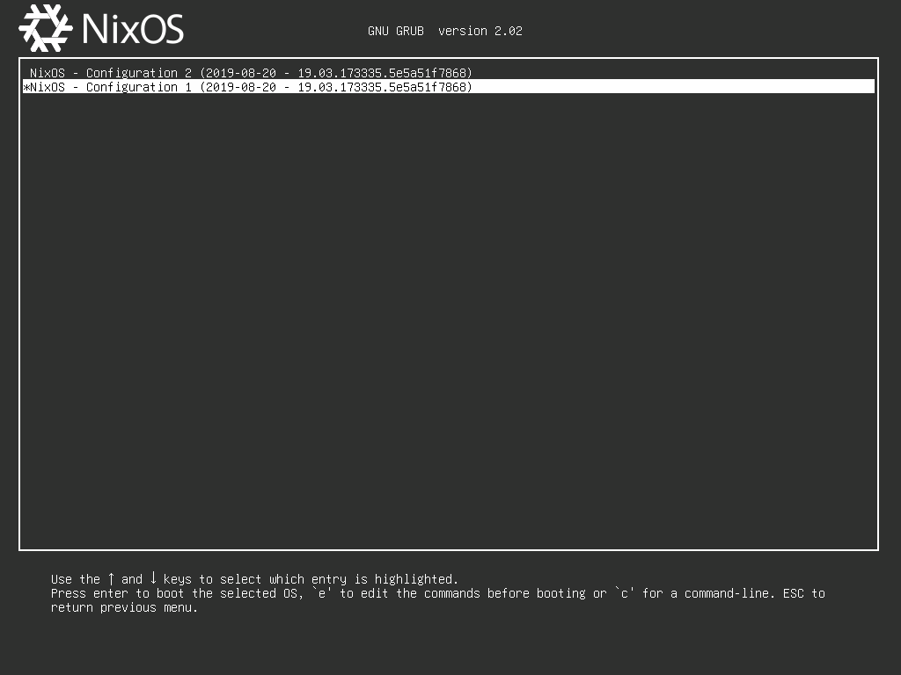
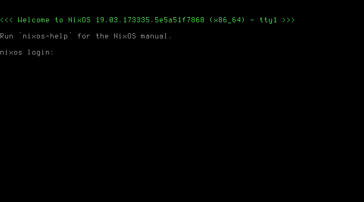

# Roll back configuration

## 📖 Overview

## 🎯 Apply the operating system configuration

Now that you have validated that your operating system builds and have activated
the configuration via `nixos-rebuild test` let's make it the boot default. That
is, the configuration which is added to the GRUB boot menu as the default menu
entry, so that subsequent reboots will boot the system into the new
configuration.

```bash
nixos-rebuild switch
```

Reboot your computer and when GRUB appears navigate to `NixOS - All
Configurations`


Press `Enter` on your keyboard and you'll see two entries:



Select `NixOS - Configuration 2` and press enter to boot back into NixOS. If all
went well then you should now be looking at a X11 login prompt:



## 🎯 Reboot to the previous configuration

Let's reboot your computer and boot back into the previous configuration which
did not have X11 configured, if you are following the bare hardware install
workshop, or did not have `htop` and your user, if you're following the
VirtualBox appliance workshop.

Reboot your computer and when GRUB appears navigate to `NixOS - All
Configurations`


Press `Enter` on your keyboard and you'll see two entries:



Select `NixOS - Configuration 1` and press enter to boot back into NixOS. If all
went well then you should now be looking at a console login prompt:



## 🎯 Roll back all changes

One of the operating modes of `nixos-rebuild [switch|test]` is `--rollback`.
Instead of building a new configuration as specified by
`/etc/nixos/configuration.nix`, you will roll back to the previous
configuration. The previous configuration is defined as the one before the
"current" generation of the system.

Let's roll all the way back to nothing:

```bash
nixos-rebuild switch --rollback
# switching from generation 2 to 1
# updating GRUB 2 menu...
# stopping the following units: alsa-store.service, display-manager.service, systemd-modules-load.service, systemd-sysctl.service, systemd-udevd-control.socket, systemd-udevd-kernel.socket, systemd-udevd.service, upower.service
# activating the configuration...
# removing group 'sddm'
# removing user 'rtkit'
# removing user 'sddm'
# setting up /etc...
# removing obsolete symlink '/etc/asound.conf'...
# removing obsolete symlink '/etc/libao.conf'...
# removing obsolete symlink '/etc/sddm.conf'...
# removing obsolete symlink '/etc/X11/xkb'...
# removing obsolete symlink '/etc/X11/xorg.conf.d/40-libinput.conf'...
# removing obsolete symlink '/etc/X11/xorg.conf.d/00-keyboard.conf'...
# removing obsolete symlink '/etc/X11/xorg.conf.d/10-evdev.conf'...
# removing obsolete symlink '/etc/openal/alsoft.conf'...
# removing obsolete symlink '/etc/pulse/default.pa'...
# removing obsolete symlink '/etc/pulse/daemon.conf'...
# removing obsolete symlink '/etc/pam.d/slim'...
# removing obsolete symlink '/etc/pam.d/kdm'...
# removing obsolete symlink '/etc/pam.d/gdm'...
# removing obsolete symlink '/etc/pam.d/sddm-greeter'...
# removing obsolete symlink '/etc/pam.d/lightdm'...
# removing obsolete symlink '/etc/pam.d/kde'...
# removing obsolete symlink '/etc/pam.d/sddm-autologin'...
# removing obsolete symlink '/etc/pam.d/sddm'...
# reloading user units for sddm...
# No passwd entry for user 'sddm'
# No passwd entry for user 'sddm'
# reloading user units for workshop...
# setting up tmpfiles
# reloading the following units: dbus.service
# restarting the following units: polkit.service, sshd.service
# starting the following units: systemd-modules-load.service, systemd-sysctl.service, systemd-udevd-control.socket, systemd-udevd-kernel.socket
```

Run it once again:

```bash
nixos-rebuild switch --rollback
# switching from generation 2 to 1
# updating GRUB 2 menu...
# activating the configuration...
# setting up /etc...
# reloading user units for workshop...
# setting up tmpfiles
# reloading the following units: dbus.service
# restarting the following units: polkit.service
```

and keep going until you run out of generations:

```bash
nixos-rebuild switch --rollback
#error: no generation older than the current (1) exists
```

Cool, let's roll-forward by applying the latest configuration:

```bash
cd /etc/nixos
nixos-rebuild switch
```

## 🎯 Save your progress

Save your progress so far:

```bash
cd /etc/nixos
git add -A
git commit -m "checkpoint commit"
```

## 📚 Additional reading material

## ⏭️ What's next

We have seen that NixOS can revert whole system configurations as if they were version-controlled. Not the configuration file, but the whole system's configuration, including installed software and users on the system. This is because NixOS is built on top of the purely functional Nix package manager, which manages system configurations as one more of the artifacts in the `/nix` store.

In the [next module][next-module] you'll learn more about the internals of the `/nix` store.

<!-- in-line links -->
[fhs-standard]: https://en.wikipedia.org/wiki/Filesystem_Hierarchy_Standard
[next-module]: ../05-introducing-the-nixstore/README.md